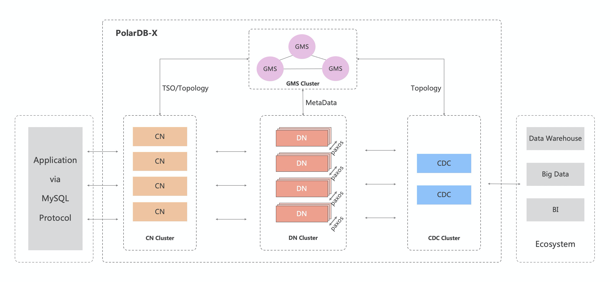

[中文文档](docs/zh_CN/README.md)

## What is PolarDB-X ？
PolarDB-X is a cloud native distributed SQL Database designed for high concurrency, massive storage, complex querying scenarios. It has a shared-nothing architecture in which computing is decoupled from storage. It supports horizontal scaling, distributed transactions and Hybrid Transactional and Analytical Processing (HTAP) workloads, and is characterized by enterprise-class, cloud native, high availability, highly compatiable with MySQL and its ecosystem.

PolarDB-X was originally created to solve the database's scalability bottleneck of Alibaba Tmall's "Double Eleven" core transaction system, and has grown with AliCloud along the way, and is a mature and stable database system that has been verified by many customers' core business systems.

The core features of PolarDB-X include:

- Horizontal Scalibility

PolarDB-X is designed with Shared-nothing architecture, supporting multiple Hash and Range data sharding algorithms and achieving transparent horizontal scaling through implicit primary key sharding and dynamic scheduling of data shard.

- Distributed Transactions

PolarDB-X adopts MVCC + TSO approach and 2PC protocol to implement distributed transactions. Transactions meet ACID characteristics, support RC/RR isolation levels, and achieve high performance through optimizations such as one-stage commit, read-only transaction, and asynchronous commit.

- HTAP

PolarDB-X supports analytical queries through native MPP capability, and achieves strong isolation of OLTP and OLAP traffic through CPU quota constraint, memory pooling, storage resource separation, etc.

- Enterprise-class

PolarDB-X has many capabilities designed for enterprise scenarios, such as SQL Concurrency Control, SQL Advisor, TDE, Triple Authority Seperation, Flashback Query, etc.

- Cloud Native

PolarDB-X has years of cloud native practice on AliCloud, supports managing cluster resources via K8S Operator, supports public cloud, hybrid cloud, private cloud and other forms for deployment.

- High Availability

PolarDB-X achieves strong data consistency through Multi-Paxos protocol, supports cross-data center deployment, and improves system availability through Table Group, Geo-locality, etc.

- Compatiable with MySQL and Its Ecosystem

The goal of PolarDB-X is to be fully compatible with MySQL, which currently includes MySQL protocol, most of MySQL SQL syntax, Collations, transaction isolation level, binary log, etc.

## Quick Start
### To quick start with PolarDB-X
PolarDB-X supports one-click installation by PXD tool, through which you can quickly try the functions of PolarDB-X.

See the [PXD Quick Start](docs/en/quickstart.md).

### To quick start with PolarDB-X on Kubernetes
PolarDB-X provides K8S deployment mode, through which you can customize the configuration of PolarDB-X cluster.

See the [K8S Quick Start](https://github.com/ApsaraDB/galaxykube#quick-start).

### To start developing PolarDB-X
If you want to compile and install PolarDB-X from source code, or start development, you can refer the [Development Guide](docs/en/quickstart-development.md).

The core features of PolarDB-X community version will be consistent with the commercial version, and more manuals can be found in [the documentations of the commercial version](https://www.alibabacloud.com/help/doc-detail/71252.htm). The documentations of the community version are being compiled and will be released to the public in the near future.

## Architecture

PolarDB-X has a shared-nothing architecture in which compute and storage is decoupled, and the system consists of 4 core components.

- CN (Compute Node)

The Compute Node is the entry point of the system and is stateless, which includes modules such as SQL parser, optimizer, and executor. It is responsible for distributed data routing, 2PC coordination, global secondary index maintenance, etc. It also provides enterprise features such as SQL concurrency control and triple authority separation.

- DN (Data Node)

The Data Node is responsible for data persistence, providing strong data consistency based on the Multi-Paxos protocol, while maintaining distributed transaction visibility through MVCC.

- GMS (Global Meta Service)

The Gloal Meta Service is responsible for maintaining globally consistent Table/Schema, Statistics and other system Meta information, maintaining security information such as accounts and permissions, and providing global timing services (i.e. TSO).

- CDC (Change Data Capture)

The CDC Node provides change data capture capability that is fully compatible with the MySQL binary log format and MySQL DUMP protocol, and master-slave replication capability that is compatible with the MySQL Replication protocol.

PolarDB-X provides tool to manage the above components through K8S Operator, and the RPC between the CN and DN can be done through private protocol component. The corresponding repositories of these components are as follows.

| **Component Name** | **Repository** |
| --- | --- |
| CN (Compute Node) | [galaxysql](https://github.com/ApsaraDB/galaxysql) |
| GMS (Global Meta Service) | [galaxyengine](https://github.com/ApsaraDB/galaxyengine) |
| DN (Data Node) | [galaxyengine](https://github.com/ApsaraDB/galaxyengine) |
| CDC (Change Data Capture) | [galaxycdc](https://github.com/ApsaraDB/galaxycdc) |
| RPC | [galaxyglue](https://github.com/ApsaraDB/galaxyglue) |
| K8S Operator | [galaxykube](https://github.com/ApsaraDB/galaxykube) |

## What is ApsaraDB GalaxySQL ？
ApsaraDB GalaxySQL is one component of PolarDB-X, namely CN (Compute Node).

## Licensing
ApsaraDB GalaxySQL is under the Apache License 2.0. See the [License](LICENSE) file for details.

## Contributing

You are welcome to make contributions to PolarDB-X. We appreciate all the contributions. For more information about how to start development and pull requests, see [contributing](CONTRIBUTING.md).

## Acknowledgements
ApsaraDB GalaxySQL references from many open source projects, such as Calcite, Presto etc. Sincere thanks to these projects and contributors.
## 

