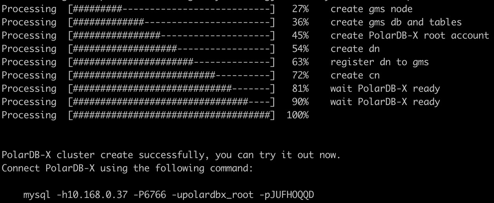

# 快速开始

本文介绍如何快速上手体验 PolarDB-X 数据库。要上手 PolarDB-X 数据库，你将使用到 PXD 工具。通过 PXD，你只需执行一行命令就可在本地快速拉起一个 PolarDB-X。
> 注意：
> - PXD 主要面向的是开发测试场景，生产环境请使用 [GalaxyKube](https://github.com/ApsaraDB/galaxykube) 在 K8S 上进行部署


## 准备工作
通过 PXD 工具部署 PolarDB-X 数据库需要先安装 Python3 和 Docker. 下面给出不同操作系统的安装方式：
> 注：PXD 目前仅支持 x86 架构的机器
*  [在 macOS 上准备测试环境](#macos-env)
*  [在 CentOS 上准备测试环境](#centos-env)
*  [在 Ubuntu 上准备测试环境](#ubuntu-env)
*  [在 Windows 上准备测试环境](#windows-env)

### <a name="macos-env">在 macOS 上准备测试环境</a>

> 注：使用 M1 处理器的 MacBook 暂不支持

1.安装 Python3
> 如果你的机器上已经安装了 python3，可以跳过 
> 检查命令：which python3，如果有返回则代表 python3 已安装
> 推荐使用 Homebrew 安装 python，如果没有 Homebrew，可参考 Homebrew 官方安装方法：
```shell
/bin/bash -c "$(curl -fsSL https://raw.githubusercontent.com/Homebrew/install/master/install.sh)"
```

```shell
brew install python
```

2.安装 Docker Desktop for Mac，参考文档：[https://docs.docker.com/desktop/mac/install/](https://docs.docker.com/desktop/mac/install/)
> 由于 Docker Desktop for Mac 的默认内存是 2G，无法满足 PolarDB-X 开发测试环境的最低要求，
> 需要在 Docker Preferences 中将内存调整到8G，如下图所示：


### <a name="centos-env">在 CentOS 上准备测试环境</a>

1.安装 Python3
> 如果你的机器上已经安装了 python3，可以跳过 
> 检查命令：which python3，如果有返回则代表 python3 已安装

```shell
yum update -y
yum install -y python3
```

2.安装 Docker, 详见文档：[https://docs.docker.com/engine/install/centos/](https://docs.docker.com/engine/install/centos/)
> 安装完成后执行 `docker ps` 命令验证。如果遇到如下报错，请参考：[非 root 用户如何获取 docker 权限](#docker-root-permission)
```text
Got permission denied while trying to connect to the Docker daemon socket at unix:///var/run/docker.sock: Get http:///var/run/docker.sock/v1.26/images/json: dial unix /var/run/docker.sock: connect: permission denied
```

### <a name="ubuntu-env">在 Ubuntu 上准备测试环境</a>

1.安装 Python3
> 可在shell中执行 `python3` 检查 Python3 是否已经安装，若已安装，直接执行第 2 步。
   
```
apt-get update
apt-get install python3.8 python3.8-venv
```

2.安装 Docker, 详见文档：[https://docs.docker.com/engine/install/)
> 安装完成后执行 `docker ps` 命令验证。如果遇到如下报错，请参考：[非 root 用户如何获取 docker 权限](#docker-root-permission)
```text
Got permission denied while trying to connect to the Docker daemon socket at unix:///var/run/docker.sock: Get http:///var/run/docker.sock/v1.26/images/json: dial unix /var/run/docker.sock: connect: permission denied
```

### <a name="windows-env">在 Windows 上准备测试环境</a>

Windows 平台上一般使用 WSL 来运行 PolarDB-X。

1.安装 WSL，参考文档：[https://docs.microsoft.com/en-us/windows/wsl/install](https://docs.microsoft.com/en-us/windows/wsl/install) ，使用默认的 Linux 发行版 Ubuntu

2.安装 Docker Desktop，参考文档：[https://docs.docker.com/desktop/windows/wsl/](https://docs.docker.com/desktop/windows/wsl/)

3.安装 Python3
> 如果你的机器上已经安装了 python3，可以跳过 

```shell
apt-get install python3
apt-get install python3-venv
```

4.安装pip

```shell
apt-get install python3-pip
```

## 安装 PXD
> 注意： 推荐使用 virtual environment 安装 PXD 工具
```shell
python3 -m venv venv
source venv/bin/activate
```

安装前建议先执行如下命令升级 pip
```shell
pip install --upgrade pip
```

执行如下命令安装 pxd: 
```shell
pip install pxd
```
> 注： 部分国内用户从 pypi 下载包的速度较慢, 可以使用如下命令从阿里云的镜像安装：
```shell
pip install -i https://mirrors.aliyun.com/pypi/simple/ pxd
```


## 部署 PolarDB-X

- 直接运行 pxd tryout 命令会创建一个最新版本的 PolarDB-X 数据库，其中 GMS, CN, DN, CDC 节点各 1 个：
```shell
pxd tryout
```

- 您也可以指定 CN，DN, CDC 节点的个数以及版本，命令如下：
```shell
pxd tryout -cn_replica 1 -cn_version latest -dn_replica 1 -dn_version latest -cdc_replica 1 -cdc_version latest
```

PolarDB-X 数据库创建完成后，会输出对应的连接信息:

> 注意：PolarDB-X 管理员账号的密码随机生成，仅出现这一次，请注意保存。

通过 MySQL client 即可连接，执行如下 SQL 初步体验 PolarDB-X 的分布式特性。PolarDB-X SQL 详情请参考：[SQL 概述](https://help.aliyun.com/document_detail/313263.html)

```sql
# 检查GMS 
select * from information_schema.schemata;

# 创建分区表
create database polarx_example partition_mode='partitioning';

use polarx_example;

create table example (
  `id` bigint(11) auto_increment NOT NULL,
  `name` varchar(255) DEFAULT NULL,
  `score` bigint(11) DEFAULT NULL,
  primary key (`id`)
) engine=InnoDB default charset=utf8 
partition by hash(id) 
partitions 8;

insert into example values(null,'lily',375),(null,'lisa',400),(null,'ljh',500);

select * from example;

show topology from example;

# 检查CDC
show master status ;
show binlog events in 'binlog.000001' from 4;


# 检查DN和CN
show storage ;  
show mpp ;  
```

## 查看 PolarDB-X 状态
执行如下命令，查看当前环境的 PolarDB-X 列表：
```shell
pxd list
```

## 清理 PolarDB-X
执行如下命令，即可清理本地环境所有的 PolarDB-X：
```shell
pxd cleanup
```

## 集群部署
PXD 除了支持在本地一键创建实例外，也支持在 Linux 集群部署 PolarDB-X，请参考：[使用 PXD 在集群部署 PolarDB-X](quickstart-pxd-cluster.md) 。

## FAQ

### <a name="docker-root-permission">非 root 用户如何获取 docker 权限</a>

1.创建 docker 用户组，其实 docker 安装时会自动创建一个名为 docker 的用户组，可以通过查看 /etc/group 确认 docker 用户组的存在，如若不存在则手动创建 docker 用户组

```shell
sudo groupadd docker
```

2.添加当前非 root 用户到 docker 用户组中

```shell
sudo gpasswd -a ${USER} docker
```
3.将当前非 root 用户的 group 切换到 docker 用户组或者退出后重新登录

```shell
newgrp docker
```

4.执行 `docker ps` 验证


### PolarDB-X 端口占用说明
目前本地测试模式，CN，DN，GMS 节点各会占用一个端口，该端口随机生成，如果因为端口冲突导致 PolarDB-X 创建失败，请执行 `pxd cleanup` 或者  `pxd delete {集群名}` 清理后重新创建即可。 
